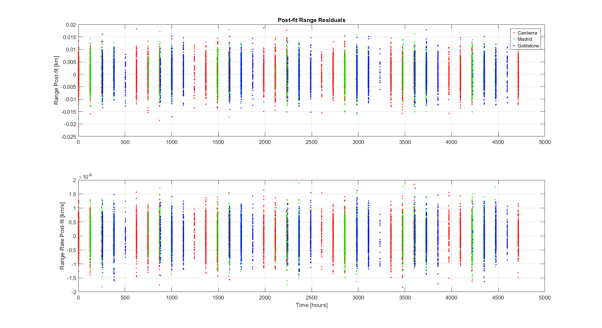
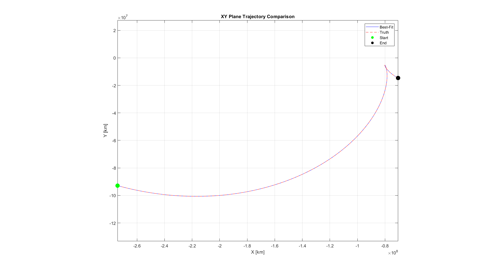
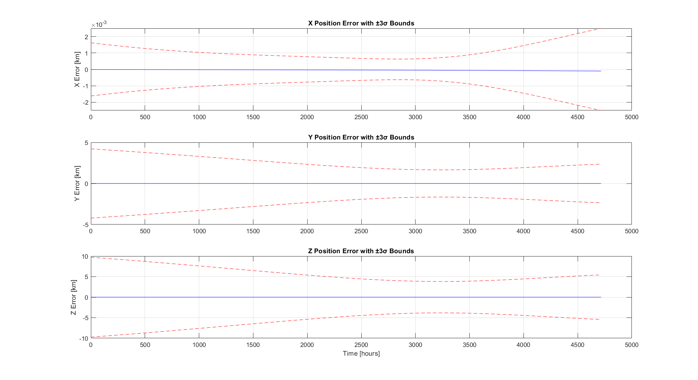
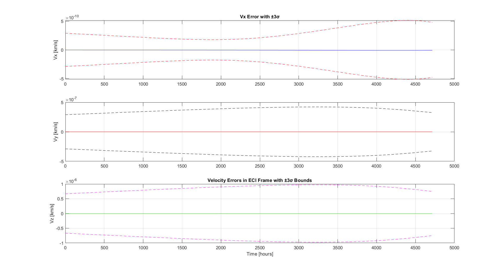
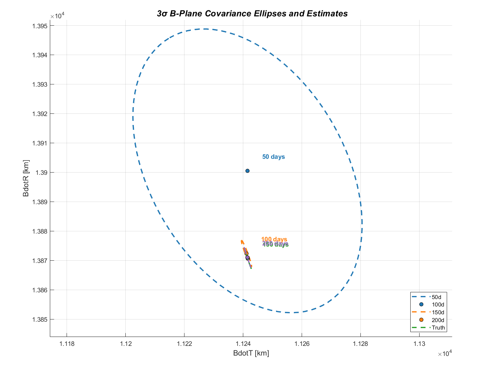
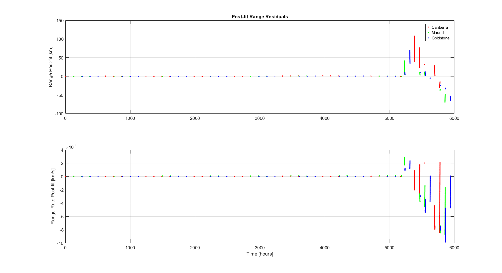
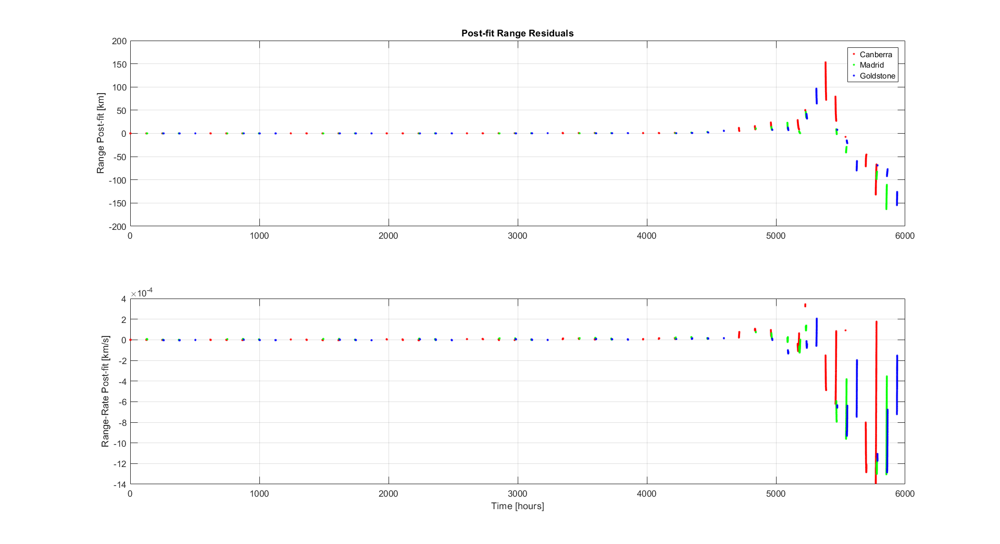
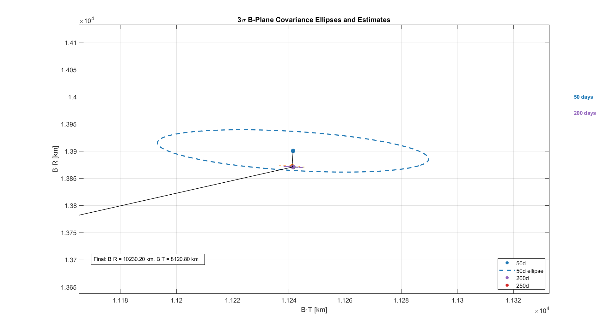
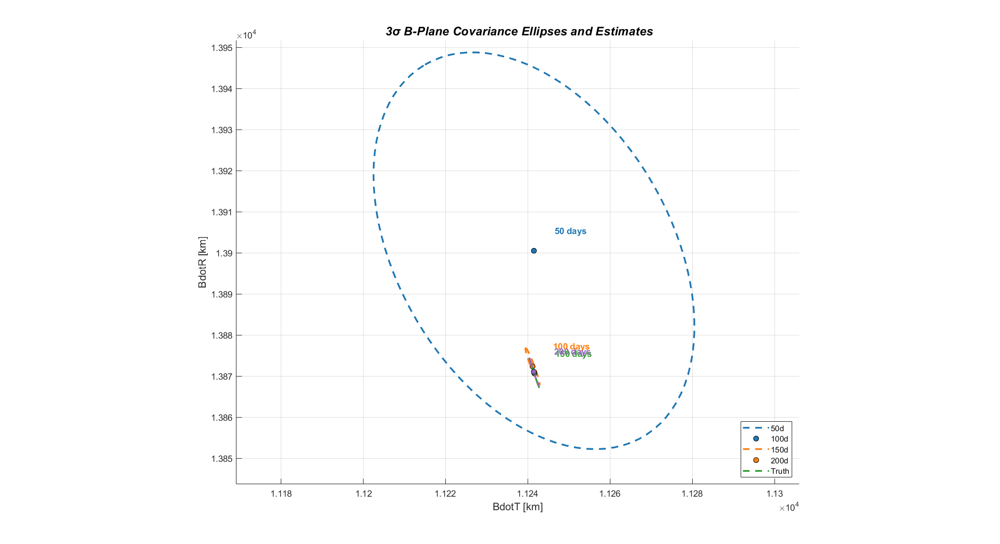

# Interplanetary Orbit Determination: Earth Flyby Navigation

Statistical orbit determination for an interplanetary spacecraft on an inbound Earth flyby trajectory. Processes Deep Space Network (DSN) range and range-rate measurements from three ground stations (Canberra, Madrid, Goldstone) using Batch Least Squares, Classical Kalman Filter, and Extended Kalman Filter to estimate spacecraft state and map targeting uncertainty to the B-plane.

Built for **ASEN 6080: Statistical Orbit Determination**, University of Colorado Boulder (Prof. Jay McMahon), Spring 2025.

---

## Mission Scenario

A spacecraft approaches Earth on a hyperbolic flyby trajectory. The navigation problem spans two scenarios:

**Part 2 — Known dynamics, truth available.** Process 200 days of DSN measurements with known force models. Estimate the 7-element state (position, velocity, solar radiation pressure coefficient CR) and evaluate B-plane targeting accuracy against truth.

**Part 3 — Unknown trajectory anomaly, no truth.** Same dynamics, but an unmodeled event occurs around day 217 inside a 1.61-day measurement gap. Detect the anomaly from filter residuals, characterize the trajectory change, and produce pre- and post-anomaly B-plane estimates.

---

## Dynamics Model

The 7-state vector is `X = [r_x, r_y, r_z, v_x, v_y, v_z, C_R]^T` in the ECI frame.

Three acceleration sources are modeled:

**Earth point-mass gravity:**
```
a_Earth = -mu_Earth / |r_sc/Earth|^3  *  r_sc/Earth
```
where `mu_Earth = 398600.4415 km^3/s^2`

**Sun third-body gravity:**
```
a_Sun = -mu_Sun * ( r_sc/Sun / |r_sc/Sun|^3  -  r_Earth/Sun / |r_Earth/Sun|^3 )
```
where `mu_Sun = 1.32712440018e11 km^3/s^2`

**Solar radiation pressure (cannonball model):**
```
a_SRP = C_R * (Phi_1AU / c) * (AU / |r_sc/Sun|)^2 * (A/m) * r_hat_Sun/sc
```
where `Phi_1AU = 1357 W/m^2`, `c = 299792.458 km/s`, `A/m = 0.01 m^2/kg`

The state transition matrix (STM) `Phi(t, t0)` is propagated alongside the equations of motion via the variational equations:
```
Phi_dot(t, t0) = A(t) * Phi(t, t0),    Phi(t0, t0) = I
```
where `A(t)` is the 7x7 Jacobian containing partial derivatives of all accelerations with respect to position, velocity, and `C_R`. Earth ephemeris is computed using the Meeus algorithm (`utils/Ephem.m`). Integration uses `ode45` with RelTol = 1e-12, AbsTol = 1e-14.

---

## Measurement Model

Range and range-rate measurements are processed from three DSN stations. Station positions rotate with Earth at `omega_Earth = 7.29212e-5 rad/s`:

```
r_station(t) = Rz(omega_Earth * t) * r_station(0)
```

Computed measurements:
```
rho     = |r_sc - r_station|
rho_dot = (r_sc - r_station) . (v_sc - v_station) / rho
```

Measurement noise: **5 m (range)**, **0.5 mm/s (range-rate)**

---

## Filtering Methods

### Batch Least Squares

Iteratively minimizes the weighted sum of squared measurement residuals over all observations. State correction per iteration:
```
x_hat = (P_bar^{-1} + H^T W H)^{-1} (P_bar^{-1} x_bar + H^T W (y - h(x)))
```
Converges when `|x_hat| < 1e-7`. Best suited for Part 2 (stationary dynamics).

### Classical Kalman Filter (CKF)

Sequential filter linearized around a fixed reference trajectory. Time update propagates state and covariance forward via the STM; measurement update applies the Kalman gain:
```
K_k = P_bar_k H_k^T (H_k P_bar_k H_k^T + R_k)^{-1}
x_hat_k = x_bar_k + K_k (y_k - h(x_bar_k) - H_k x_bar_k)
P_k = (I - K_k H_k) P_bar_k (I - K_k H_k)^T + K_k R_k K_k^T   [Joseph form]
```

### Extended Kalman Filter (EKF)

Extends the CKF by re-linearizing around the current state estimate at each step. This provides better handling of nonlinear dynamics and adapts more quickly to trajectory changes. For Part 3, process noise `Q_k` is injected adaptively:

- Nominal operations: `Q_nominal = 0`
- Maneuver window (post-gap): elevated `Q_high` concentrated around the anomaly time

The EKF also supports explicit maneuver modeling by applying an impulsive delta-V at the estimated maneuver epoch and re-linearizing from the post-maneuver state.

---

## Part 2 Results: Known Scenario

### Batch Filter Convergence

| Iteration | Pre-fit Range RMS (m) | Pre-fit Range-Rate RMS (mm/s) | Post-fit Range RMS (m) | Post-fit Range-Rate RMS (mm/s) |
|-----------|----------------------|-------------------------------|------------------------|-------------------------------|
| 1         | 21539.9              | 4.57123                       | 3384.66                | 2.28393                       |
| 2         | 4.68184              | 0.00236                       | 1.55456                | 0.00302                       |
| 3         | 0.0767333            | 0.000503                      | 0.0179993              | 0.000503                      |
| 4         | 0.00496014           | 0.000503                      | 0.00495991             | 0.000503                      |
| 5         | 0.00496016           | 0.000503                      | 0.00495992             | 0.000503                      |

Final post-fit RMS of **4.96 m (range)** and **0.50 mm/s (range-rate)** match the expected measurement noise, confirming a well-converged solution.

### Pre-fit and Post-fit Residuals




Post-fit range residuals are bounded within ±0.02 km and range-rate within ±2×10⁻⁶ km/s, consistent with the specified measurement noise. The white-noise character of the post-fit residuals confirms the filter is not systematically mismodeling the dynamics.

### Trajectory Comparison



The batch filter best-fit trajectory lies directly on top of the truth, confirming the dynamics model is correctly implemented.

### Position and Velocity 3-sigma Covariance Envelopes





### B-Plane Targeting Accuracy

B-plane parameters computed at `3 x R_SOI = 2,775,000 km`:

| Data Arc | B·R (km)  | B·T (km)  |
|----------|-----------|-----------|
| 50 days  | 15003.41  | 9795.59   |
| 100 days | 14972.75  | 9796.46   |
| 150 days | 14970.90  | 9797.02   |
| 200 days | 14971.34  | 9796.86   |
| **Truth**| **14970.82** | **9796.74** |

After 150 days, B·R is within **0.08 km (0.0005%)** and B·T within **0.28 km (0.003%)** of truth.



The B-plane covariance ellipses shrink by more than an order of magnitude between 50 and 200 days of data, with the largest reduction between 50 and 100 days. The truth target is enclosed within all ellipses from 100 days onward.

---

## Part 3 Results: Anomaly Detection and Characterization

### Anomaly Detection

CKF and EKF residuals both showed a sharp spike around **hour 5200 (day ~217)**. A measurement gap of **139,228 seconds (~1.61 days)** was identified between times 18,674,940 s and 18,814,168 s. Measurements before and after the gap maintained consistent 60-second intervals, but the post-gap trajectory was irreconcilable with pre-gap dynamics under standard force models.

### Filter Comparison

| Filter | Pre-fit Range RMS | Pre-fit Range-Rate RMS | Post-fit Range RMS | Post-fit Range-Rate RMS |
|--------|-------------------|------------------------|---------------------|-------------------------|
| Batch  | 10549.8 m         | 1.95 mm/s              | 0.278 m             | 0.00279 mm/s            |
| CKF    | 14,005,873.9 km   | 2375.25 km/s           | 35.65 km            | 0.36 mm/s               |
| EKF    | 14,005,873.9 km   | 16.73 km/s             | 16.67 km            | 0.23 mm/s               |

The batch filter produced artificially small post-fit residuals by distributing the anomaly error across the entire arc — it cannot localize a trajectory discontinuity. The CKF and EKF correctly flagged the anomaly through large residual spikes. The EKF outperformed the CKF, requiring ~10-15 measurements to re-converge post-anomaly versus ~25-30 for the CKF.

### EKF and CKF Post-fit Residuals (Part 3)





### Residual Statistics Before and After Gap

| Segment                        | Range RMS (m) | Range-Rate RMS (mm/s) |
|-------------------------------|---------------|----------------------|
| Pre-gap                        | 4.83          | 0.47                 |
| Post-gap (no maneuver model)   | 121.62        | 3.86                 |
| Post-gap (with maneuver model) | 5.76          | 0.56                 |

### Estimated Maneuver Parameters

Impulsive maneuver modeled at time **18,744,554 s** (midpoint of measurement gap):

| Component | Value (km/s) |
|-----------|-------------|
| dV_x      | +0.0183     |
| dV_y      | -0.0092     |
| dV_z      | +0.0056     |
| |dV|      | **0.0211 km/s = 21.1 m/s** |

A 21.1 m/s delta-V is consistent with a trajectory correction maneuver (TCM) for an interplanetary mission, supporting the conclusion that the anomaly was a planned maneuver rather than a force model failure.

### B-Plane Results with Anomaly

| Data Arc            | B·R (km)  | B·T (km)  | sigma_B·R (km) | sigma_B·T (km) |
|--------------------|-----------|-----------|----------------|----------------|
| Pre-anomaly 50d    | 13900.51  | 11241.49  | 16.10          | 13.00          |
| Pre-anomaly 100d   | 13872.33  | 11241.16  | 1.49           | 0.58           |
| Pre-anomaly 150d   | 13870.64  | 11241.60  | 1.26           | 0.42           |
| Pre-anomaly 200d   | 13871.04  | 11241.47  | 1.15           | 0.38           |
| Post-anomaly 250d  | 10230.20  | 8120.80   | 3.87           | 2.65           |

The post-anomaly B-plane target shifts by approximately **3640 km in B·R and 3120 km in B·T** — far too large to be explained by model error. This confirms a deliberate flyby geometry change.





---

## B-Plane Sensitivity to Computation Radius

B-plane parameters were evaluated at 1, 2, 3, and 5 times R_SOI to quantify non-Keplerian warp from SRP and third-body gravity.

**Pre-anomaly trajectory:**

| Radius                        | B·R (km)  | B·T (km)  |
|-------------------------------|-----------|-----------|
| 1 R_SOI (925,000 km)          | 13878.29  | 11235.62  |
| 2 R_SOI (1,850,000 km)        | 13875.38  | 11237.82  |
| 3 R_SOI (2,775,000 km)        | 13871.04  | 11241.47  |
| 5 R_SOI (4,625,000 km)        | 13866.41  | 11245.83  |

B·R decreases by **11.88 km (0.085%)** and B·T increases by **10.21 km (0.091%)** across the full radius range, driven by SRP and Sun third-body perturbations warping the hyperbolic asymptote. This motivates standardizing the computation radius (conventionally 3 R_SOI) for consistent mission-to-mission comparisons.

---

## EKF vs. CKF: Quantitative Comparison

| Metric                      | EKF         | CKF         |
|-----------------------------|-------------|-------------|
| Pre-fit Range RMS           | 0.560 km    | 0.742 km    |
| Pre-fit Range-Rate RMS      | 4.3e-5 km/s | 8.9e-5 km/s |
| Post-fit Range RMS          | 6.945 m     | 18.373 m    |
| Post-fit Range-Rate RMS     | 0.001 mm/s  | 0.004 mm/s  |
| Post-anomaly re-convergence | ~10-15 obs  | ~25-30 obs  |
| Anomaly detection clarity   | Clear spike | Distorted   |

EKF post-fit range residuals are **2.6x lower** than CKF, with cleaner anomaly localization and more stable process noise tuning.

---

## Process Noise Strategy (Part 3)

Three process noise approaches were evaluated for the anomaly scenario:

**Threshold-based:** Different `Q` values before and after the suspected anomaly time.
```
Q_pre  = diag([2e-4, 2e-4, 2e-4, 2.5e-15, 2.5e-15, 2.5e-15, 0])
Q_post = diag([2e-6, 2e-6, 2e-6, 6e-14,   6e-14,   6e-14,   0])
```

**Maneuver window detection:** Identifies measurement gaps exceeding a 600-second threshold, then applies elevated `Q_high` only within a short window following each gap. Concentrates noise injection where it is most needed while preserving filter precision during nominal arcs.

**Explicit maneuver modeling (best results):** Applies an impulsive delta-V at the estimated maneuver epoch and re-linearizes from the post-maneuver state. Produced the lowest post-fit residuals and physically interpretable maneuver parameters.

---

## Repository Structure

```
interplanetary-orbit-determination/
|
|-- main_all_filters.m          # Top-level driver: all three filters, full post-processing
|-- main_part2_batch.m          # Part 2 standalone: batch filter only
|-- main_bplane_analysis.m      # B-plane analysis and multi-epoch ellipse plotting
|
|-- filters/
|   |-- filter_LS.m             # Batch least squares (iterated, weighted)
|   |-- filter_ck.m             # Classical Kalman Filter
|   |-- filter_ekf.m            # Extended Kalman Filter with process noise strategies
|
|-- dynamics/
|   |-- twobodySunSRP.m         # EOM + STM: Earth gravity + Sun third-body + SRP
|   |-- compute_jacobian_analytical.m  # Analytical A matrix (7x7 Jacobian)
|   |-- propagate_state_and_stm.m      # Standalone state + STM propagator
|
|-- measurements/
|   |-- epoch_range_rangerate.m        # Computes theoretical rho and rho-dot
|   |-- Htilde_6080.m                  # Measurement partial matrix H-tilde (2x7)
|   |-- compute_measurement_partials.m # Measurement partials (alternate implementation)
|
|-- bplane/
|   |-- propagate_to_bplane.m          # Propagates state + covariance to B-plane
|   |-- compute_bplane.m               # Computes B.R and B.T from state
|   |-- build_bplane_rotation_matrix.m # Constructs S-T-R frame from v_infinity
|   |-- plot_bplane_ellipses.m         # Multi-epoch 3-sigma ellipse plots
|   |-- error_ellipse.m                # General 2D error ellipse utility
|   |-- plot_covariance_ellipsoid.m    # 3D covariance ellipsoid visualization
|
|-- utils/
|   |-- Ephem.m                        # Earth ephemeris (Meeus algorithm)
|   |-- eletorv.m                      # Orbital elements to position/velocity
|   |-- test_dynamics.m                # Dynamics verification against truth trajectory
|   |-- Bplane_dynamics_verification.m # B-plane geometry verification
|
|-- figures/                           # Simulation output plots
|-- README.md
```

**Note:** Course observation data files (`Project2a_Obs.txt`, `Project2b_Obs.txt`) and the truth trajectory (`Project2_Prob2_truth_traj_50days.mat`) are not included as they are proprietary course materials. The code is fully functional with equivalent DSN measurement data in the same format.

---

## How to Run

**Dependencies:** MATLAB R2021a or later. No additional toolboxes required.

**Part 2 (known scenario, batch filter):**
```matlab
run('main_part2_batch.m')
```

**All filters with full post-processing (set `useFilter = 1/2/3` at top of file):**
```matlab
% useFilter = 1  →  Batch Least Squares
% useFilter = 2  →  Classical Kalman Filter
% useFilter = 3  →  Extended Kalman Filter (use for Part 3)
run('main_all_filters.m')
```

**B-plane analysis at multiple epochs:**
```matlab
run('main_bplane_analysis.m')
```

Place observation data files in the root directory before running.

---

## Key Technical Skills Demonstrated

- Statistical orbit determination: batch least squares, CKF, EKF
- Variational equations and STM propagation for linearized covariance mapping
- Analytical Jacobian derivation for a multi-force dynamics model (gravity + SRP)
- DSN ground station geometry: ECEF-to-ECI rotation, range and range-rate partial derivatives
- B-plane targeting: S-T-R frame construction, hyperbolic asymptote propagation, linearized time of flight, covariance projection
- Anomaly detection via sequential filter residual analysis
- Adaptive process noise design and explicit maneuver parameter estimation
- Solar system ephemeris computation (Meeus algorithm)

---

## References

- Schaub, H. and Junkins, J. L., *Analytical Mechanics of Space Systems*, 4th ed., AIAA Education Series, 2018.
- Montenbruck, O. and Gill, E., *Satellite Orbits: Models, Methods and Applications*, Springer, 2000.
- Kizner, W., "A Method of Describing Miss Distances for Lunar and Interplanetary Trajectories," *Planetary and Space Science*, 1961.
- McMahon, J., *ASEN 6080: Statistical Orbit Determination*, Course Notes, University of Colorado Boulder, Spring 2025.
